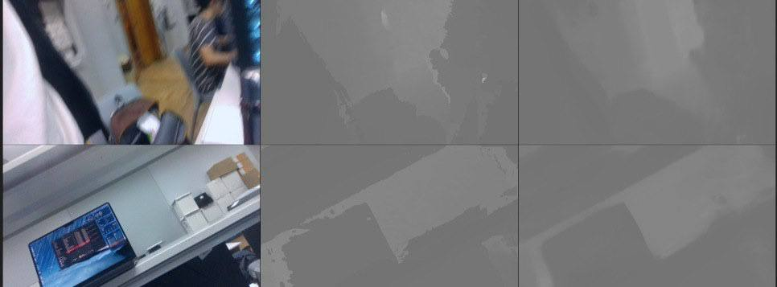

# RealDepth

Real-time monocular depth estimation using MobileNetV2 encoder, ConvGRU temporal fusion, and lightweight depthwise separable decoder. ~1.07M parameters, enabling real-time depth estimation on standard hardware with temporal consistency across video frames.

Dataset: RealSense D435i camera data (RGB + depth)

## Results

Training visualization showing RGB inputs (left), ground truth depth image (center) and predicted depth maps (right):



## Installation

Requires Python >=3.8, <3.11 (pyrealsense2 constraint). pyrealsense2 doesn't work on macOS.

```bash
python3.10 -m venv venv
source venv/bin/activate
pip install -r requirements.txt
python setup.py develop
```

## Quick Start

### Collect Your Own Dataset

**1. Collect data with RealSense D435i:**

```bash
python scripts/collect_dataset.py --duration 1200 --fps 30
```
fps only 6, 15 or 30

This creates `collected_dataset/<timestamp>/` with:
- `rgb/` - RGB images (1280x720)
- `depth/` - 16-bit depth PNGs in millimeters
- `intrinsics.txt` - Camera calibration

**For good data:**
- Move slowly to avoid motion blur
- Record different rooms, lighting, and distances

**2. Split dataset into train/val/test:**

```bash
python scripts/split_dataset.py
```
This organizes data into `dataset/` with 80/10/10 split.

**3. Train on your data:**

Edit your config file in `configs/` that controls training.

```bash
python scripts/train.py
```

### Inference

```bash
python scripts/infer_image.py --checkpoint <path> --image <path>   # Single image
python scripts/infer_camera.py --checkpoint <path>                  # Real-time camera feed
python scripts/infer_compare.py --checkpoint <path>                 # Side-by-side comparison
```

### Validation

```bash
python scripts/validate.py --checkpoint <path> --config <config_path> --split <val|test>
```

## Architecture

MobileNetV2 encoder + ConvGRU temporal fusion + lightweight depthwise separable decoder (~1.07M params):

- **Encoder** (543K params): Pretrained MobileNetV2 layers 0-13, extracts features at 5 scales: 16ch@1/1, 16ch@1/2, 24ch@1/4, 32ch@1/8, 96ch@1/16
- **ConvGRU** (498K params): Convolutional GRU at the 96ch bottleneck (1/16 scale). Propagates temporal context across video frames via update/reset gates
- **Decoder** (28K params): 4 lightweight decoder blocks using NN upsample + 5x5 depthwise separable convs (NNConv5 from FastDepth). Channel plan: 96 → 64 → 32 → 16 → 16 → 1
- **Skip connections**: Preserve spatial details from encoder to decoder

### Three-Stage Training
1. **Stage 1**: Freeze encoder + decoder, train only ConvGRU
2. **Stage 2**: Freeze encoder, train ConvGRU + decoder
3. **Stage 3**: Unfreeze all, end-to-end fine-tuning with lower encoder LR

## License

MIT License